# Industry-Level Git & GitHub commands practice

## 1.Git Configuration Commands

### 1.1 git config --global user.name

### Syntax:
```bash
git config --global user.name
```

### Purpose:
Sets the global username for all repositories.

### Example
```bash
git config --global user.name chakrapani-N22OOO8
```

### Screenshot Proof
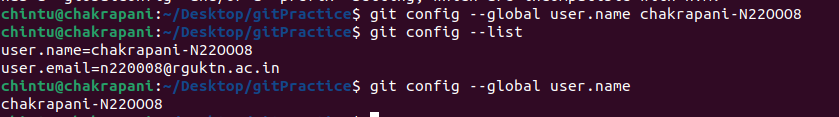

---

## 1.2 git config --global user.email

### Syntax:
```bash
git config --global user.email your@email.com
```

### Purpose:
Sets the global email for Git commits.

### Example:
```bash
git config --global user.email n220008@rguktn.ac.in
```

### Screenshot Proof
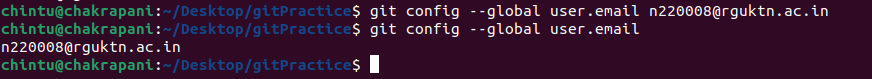

---

## 1.3 git config --list

### Syntax:
```bash
git config --list
```

### Purpose:
Displays all configured Git settings.

### Example:
```bash
git config --list
```

### Screenshot Proof:
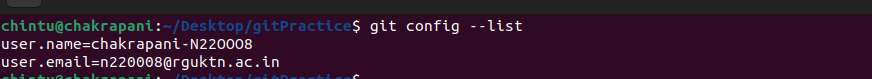

---

## 1.4 git config --unset

### Syntax
```bash
git config --unset user.name
```

### Purpose
Removes a configuration value.

### Example:
```bash
git config --unset user.name
```

### Screenshot Proof


---

# 2. Repository Setup Commands

## 2.1 git init

### Syntax:
```bash
git init
```

### Purpose
Initializes a new Git repository.

### Example:
```bash
git init
```

### Screenshot Proof
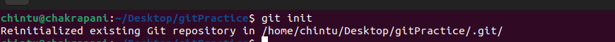

---

## 2.2 git clone

### Syntax:
```bash
git clone <repository-url>
```

### Purpose:
Creates a local copy of a remote repository.

### Example:
```bash
git clone https://github.com/chakrapani-N220008/demo-git.git

```

### Screenshot Proof
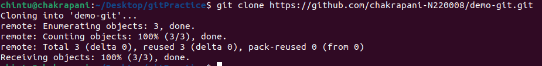

---

## 2.3 git clone --branch

### Syntax:
```bash
git clone --branch branch-name <repository-url>
```

### Purpose:
Clones a specific branch only.

### Example:
```bash
git clone --branch main https://github.com/chakrapani-N220008/demo-git.git
```
### Screenshot Proof
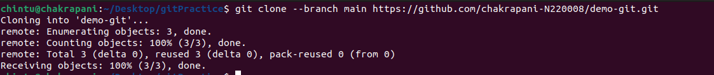

---

## 2.4 git clone --depth

### Syntax
```bash
git clone --depth 1 <repository-url>
```

### Purpose:
Performs shallow clone with limited commit history.

### Example:
```bash
git clone --depth 1 https://github.com/chakrapani-N220008/demo-git.git

```

### Screenshot Proof
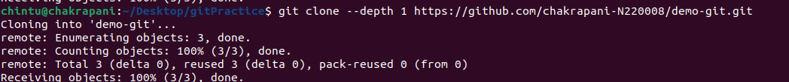

---

# 3. Repository Status & Inspection

## 3.1 git status

### syntax:
```bash
git status
```
### purpose:
Shows working directory status.

### example:
```bash
git status
```
### Screenshot Proof
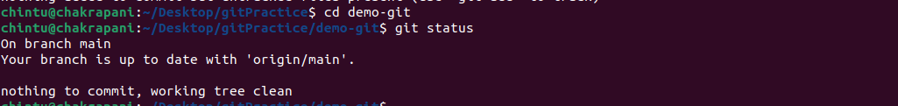
---

## 3.2 git log

### syntax:
```bash
git log
```
### purpose:
Shows full commit history.
### example:
```bash
git log
```
### Screenshot Proof


---

## 3.3 git log --oneline
### Syntax:
```bash
git log --oneline
```
### Purpose:
Compact commit history.

### Example:
```bash
git log --oneline
```
### Screenshot Proof


---

## 3.4 git log --graph

### Syntax:
```bash
git log --graph --oneline --all
```
### Purpose:
Displays branch graph visually.

### Example:
```bash
git log --graph --oneline --all
```
### Screenshot Proof:

---

## 3.5 git show

### Syntax:
```bash
git show <commit-hash>
```
### Purpose:
Shows details of a commit.

### Example:
```bash
git show 424c59d
```
### Screenshot Proof:
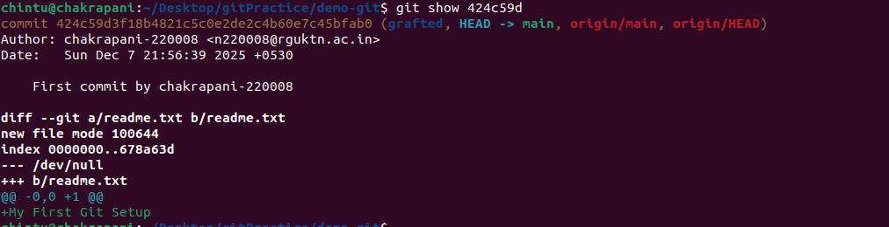
---

## 3.6 git diff

### Syntax:
```bash
git diff
```
### Purpose:
Shows unstaged changes in the same file

### Example:
```bash
git diff
```
### ScreenShot proof:
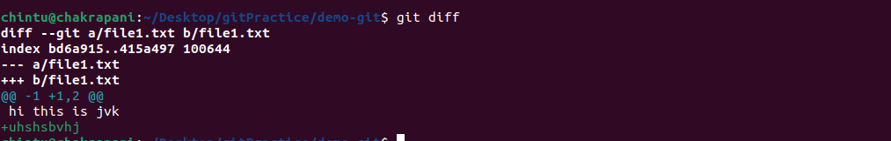
---

## 3.7 git diff --staged
### Syntax:
```bash
git diff --staged
```
### Purpose:
Shows staged changes.

### Example:
```bash
git diff --staged
```
### Screenshot Proof:
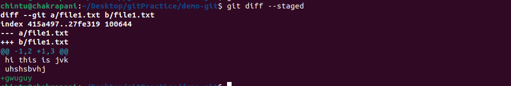
---

## 3.8 git blame
### Syntax:
```bash
git blame filename
```
### Purpose:
Shows who modified each line.

### Example:
```bash
git blame file1.txt
```
### Screenshot Proof:
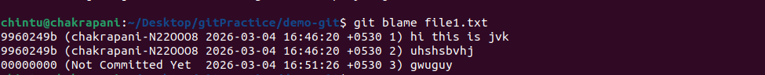
---


## 3.9 git reflog
### Syntax:
```bash
git reflog
```
### Purpose:
Shows reference history (HEAD movements) and all history (checkout branch too) except staged and deleted .
### Example:
```bash
git blame file1.txt
```
### Screenshot Proof:
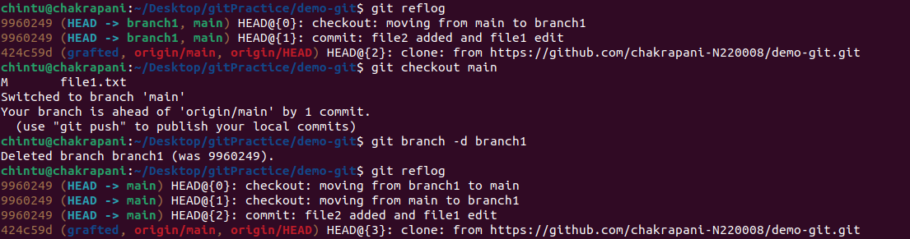

---

## 3.10 git shortlog
### Syntax:
```bash
git shortlog
```
### Purpose:
Summarizes commits by author from first to last

### Example:
```bash
git shortlog
```
### Screenshot Proof:
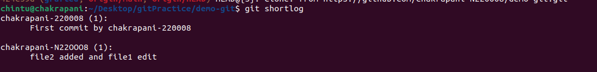
---

# 4. File Tracking Commands

## 4.1 git add
### Syntax:
```bash
git add filename
```
### Purpose:
Stages specific file.
### Example:
```bash
git add file3.txt
```
### Screenshot Proof:
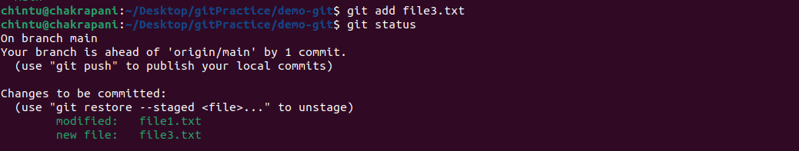

---

## 4.2 git add .
### Syntax:
```bash
git add .
```
### Purpose:
Stages all changes.
### Example:
```bash
git add .
```
### Screenshot Proof:


---

## 4.3 git add -p
### Syntax:
```bash
git add -p 
```
### Purpose:
Stages changes interactively.

---

## 4.4 git restore

```bash
git restore filename
```

Restores working directory file.

---

## 4.5 git restore --staged

```bash
git restore --staged filename
```

Unstages file.

---

## 4.6 git rm

```bash
git rm filename
```

Removes file from repository.

---

## 4.7 git mv

```bash
git mv oldname newname
```

Renames or moves file.

---

# 5️⃣ Commit Commands

## 5.1 git commit

```bash
git commit
```

Opens editor for commit message.

---

## 5.2 git commit -m

```bash
git commit -m "Commit message"
```

Creates commit with message.

---

## 5.3 git commit --amend

```bash
git commit --amend
```

Modifies last commit.

---

## 5.4 git commit --no-edit

```bash
git commit --amend --no-edit
```

Amends commit without changing message.

---

# 6️⃣ Branch Management Commands

## 6.1 git branch

```bash
git branch
```

Lists local branches.

---

## 6.2 git branch -a

```bash
git branch -a
```

Lists local & remote branches.

---

## 6.3 git branch -d

```bash
git branch -d branch-name
```

Deletes merged branch.

---

## 6.4 git branch -D

```bash
git branch -D branch-name
```

Force deletes branch.

---

## 6.5 git checkout

```bash
git checkout branch-name
```

Switches branch.

---

## 6.6 git checkout -b

```bash
git checkout -b new-branch
```

Creates & switches branch.

---

## 6.7 git switch

```bash
git switch branch-name
```

Modern branch switching.

---

## 6.8 git switch -c

```bash
git switch -c new-branch
```

Creates & switches branch.

---

(Continue same structure for remaining sections exactly like above.)

---

# Final Submission

```bash
git add git_industry_commands.md
git commit -m "Added industry level Git commands practice"
git push
```